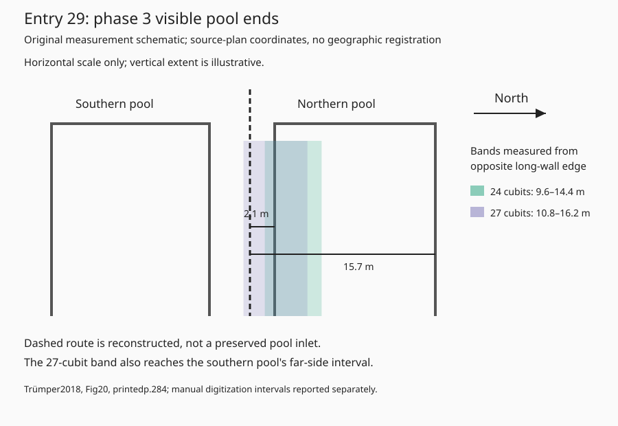

# Entry 29: northern pool of the Hasmonean Pools Complex, Jericho

Assessment completed 2 October 2026 UTC. **Result: inconclusive.** The northern pool is a specific provisional feature candidate. This assessment supplies reproducible offsets, a southern-pool control and a construction-phase review. Its present evidence does not distinguish that pool as the scroll’s reservoir or locate a deposit.

## Hypothesis and source scope

Test entry 29, VII 3–7, against the northern of the two large pools marked palace phase 3 in the Hasmonean Pools Complex. In Trümper’s Fig. 18, printed p. 281, north points up and the candidate is the upper of the paired pools. In Figs. 20–22, printed pp. 284–286, north points right and it is the right-hand pool. No excavation locus number is assigned to this candidate without verification in the original report. A(C)94 is a different pool and its dimensions/elevations are excluded.

The tested geometry is perpendicular distance from either **inner long-wall face** to the central inter-pool route, confined to the short wall segments actually visible in each detailed figure. The southern pool receives the same test. The models are conditional on Puech’s side-reference reconstruction and our interpretation of “large” as long. Northern describes the reservoir; it supplies no measurement bearing. The original source defines neither a perpendicular axis nor a route-distance starting junction.

Puech’s actual edition images, printed pp. 62–65, were reinspected. Jericho is entirely restored; the starting-side relationship and parts of the numeral are also reconstructed. His preferred 24-cubit reading and the apparatus’s 27-cubit alternative are retained as separate branches. His note 259 says Netzer’s Jericho suggestion preceded his restoration. The specific northern pool and sampled channel are our hypothesis, rather than a pool identified on that page. [Detailed reading constraints](reading-note.md).

Trümper’s actual page images, printed pp. 280–286 and p. 296 illustration credits, were inspected. This is an authored archaeological reanalysis using Netzer-derived plans. It supplies accessible evidence from the same excavation lineage, rather than independent corroboration. [Phase and provenance review](phase-review.md).

## Measurement result

Use an exploratory cubit range of 0.40–0.60 m: 24 cubits = 9.6–14.4 m; 27 cubits = 10.8–16.2 m. These are sensitivity assumptions, not an established local cubit standard. Figs. 20–22 have legible 10 m scale bars. Complete pool lengths are cropped from those figures; the overview establishes orientation but was not used for metric calibration. The subsequent Kotar inspection supplies Netzer’s approximately 18 × 13 m published dimensions for both earlier pools and a complete p. 100 plan; see the follow-up below. The frozen offsets continue to use their original 2018 figures.

| Model | Northern pool | Southern control | Interpretation |
|---|---|---|---|
| Phase 3 / Fig. 20 | Near side 2.09 m; far side 15.65 m | Near side 3.48 m; far side 16.78 m | Neither nominal offset reaches the 24-cubit band. |
| Phase 5 / Fig. 21 | Near side 2.26 m; far side 15.65 m | Near side 3.30 m; far side 16.78 m | Same conditional result; repeated drawing geometry adds no independent evidence. |
| Phase 6 / Fig. 22 | Unclassified central line: near 1.02 m; far 14.24 m | Near 4.41 m; far 17.37 m | Line identity unresolved; excluded from qualifying channel matches. |

Decimal precision here supports recomputation; reporting archaeological accuracy at centimetre scale would be unjustified. Picks were made in full-page 2× fitz renders. A tighter assumed error envelope gives the phase-3/5 northern far distance 14.62–16.76 m; a wider stress envelope gives 14.05–17.43 m. **The nominal 24-cubit miss therefore cannot exclude this branch robustly.** Near-side offsets remain far too small in both envelopes.

The 27-cubit branch overlaps the northern far-side interval and the southern control’s far-side interval. This overlap fails to distinguish the northern pool geometrically. The southern pool is a geometry control; it does not satisfy the northern-reservoir designation as a whole candidate. Phase 6’s numerical overlap is an unclassified-line coincidence requiring feature identification before it can count as support. No all-channel search or hidden wall extension is represented as tested. [Full geometry note](assessment.md), [pixel inputs and results](measurements.json), [recomputation script](measure.py).

The schematic shows a sampled cross-section near the visible western ends. It is an original simplified diagram with metres in source-plan space. It is neither a complete pool footprint nor a geographically registered candidate area. See the input JSON for finite sample segments. No WGS84 deposit coordinate is proposed.

## Phase and preservation

The overview assigns palace phase 3 to 103–76 BCE, phase 5 to 76–67 BCE, and phase 6 to 67–63 BCE. These labels do not precisely date every channel line. The account distinguishes successive supply arrangements; their prose numbering must not be equated with palace phase numbers.

Trümper printed p. 285 explicitly reports that Herodian alterations left the original pool inlets and inter-pool pipe unpreserved. A reconstructed line cannot provide an observed inlet datum. Earlier construction is period-compatible. Netzer’s newly inspected 1983 pp. 105–106 describe Herodian joining of these two pools into one basin, creating an explicit limit on a separate-northern-pool later-use model. The relevant channel’s continued accessibility and a dated concealment surface remain unresolved. [Exact pages and source lineage](phase-review.md).

## Confidence and next discriminating test

- Reading: edition-based and damaged; 24 and 27 cubit branches retained, side datum conditional.
- Site association: low; Jericho is restored and the cited archaeology identifies no unique pool for entry 29.
- Feature identity: low; northern pool remains possible, with no distinctive dimensional result over the southern control.
- Phase: broad Hasmonean compatibility; individual channel phase and later survival unresolved.
- Position: sampled source-plan offsets only; no geographic registration or ancient inlet point.

The original pass left the whole candidate open while documenting a nonunique geometry branch. Current work follows [ACTIVE_TEST.md](https://github.com/quadrin/CopperScroll/blob/main/research/ACTIVE_TEST.md) and the [preparation audit below](#comparison-design-and-exposure-audit--3-october-2026-utc). Protect observations reserved for confirmation while logged exploratory sourcing continues; resolve each test's relevant design and exposure dependencies before revealing its reserved evidence. Route-distance models require a physically justified starting junction.

## Access links and reproducibility

Accessible: Monika Trümper, “Swimming Pools and Water Management in the Eastern Mediterranean World of the 4th to 1st Century BC,” in Jonas Berking, ed., *Water Management in Ancient Civilizations*, Berlin Studies of the Ancient World 53 (2018), pp. 255–296. [Direct publisher PDF](https://edition-topoi.org/download_pdf/bsa_053_10.pdf). File SHA-256 `0d0cd8031e3e03181d67942851017f7a4ae9219f0bc405c97f954b094f7efab7`; 42 PDF pages; printed page = PDF page + 254. Render PDF pages 30–32 at fitz Matrix(2,2) to inspect recorded pixel picks. Run `python measure.py` to regenerate the JSON from the frozen picks. This recomputes manual measurements; it does not automatically reidentify the archaeology.

Historical access state at the first assessment; subsequent supplied-page inspections below supersede it to their stated scope:

- Ehud Netzer, *Hasmonean and Herodian Palaces at Jericho: Final Reports of the 1973–1987 Excavations*, Vol. I, *Stratigraphy and Architecture* (Israel Exploration Society, 2001): [publisher record](https://www.israelexplorationsociety.com/product-page/volume-i-stratigraphy-and-architecture-2001). Relevant text pp. 74–84 and plans 14, 17–21; rerouting pp. 92–100 and plans 17–22, as cited by Trümper. Those original pages were not recovered here.
- Ehud Netzer, *The Palaces of the Hasmoneans and Herod the Great* (English edition, 2001): [publisher record](https://www.israelexplorationsociety.com/product-page/the-palaces-of-the-hasmoneans-and-herod-the-great-1), [Google Books record without ebook/reader](https://books.google.com/books/about/The_Palaces_of_the_Hasmoneans_and_Herod.html?id=eGhoQgAACAAJ). Trümper’s credits point to p. 93 / plan 17, p. 96 / plan 19, and p. 7 / plan 20; the last is the surprising printed credit and remains uncorrected. Her bibliography’s edition metadata differs from the English publisher record; exact source edition/pagination needs checking.

New KPI contributions: one scoped Trümper source target and one bounded offset/control check. Puech reinspection adds no target. One conditional candidate assessment is completed with an inconclusive result; decisive tests and question closures remain zero. Current cumulative totals: 22 direct targets, 5 cartographic intakes, 22 bounded checks, 0 decisive tests, 0 closures.

## Kotar follow-up — 2 October 2026, Los Angeles

Netzer’s 1983 original chapter now supplies a complete plan (p. 100), approximately 18 × 13 m for each early pool (p. 101), and a later plan/text identifying Herod’s joining of the pair into one approximately 32 × 18 m basin (pp. 105–106, footnote). This adds a specific conflict with assuming survival of two separate reservoirs into a later-use model. A merged northern basin is a separate possible hypothesis and changes which sides are longer; the earlier offset calculations cannot transfer to it. Candidate confidence remains low and the assessment inconclusive. One new source target and one bounded survival check bring totals to 23 direct targets / 5 map intakes / 23 bounded checks / 0 decisive tests / 0 closures. [Image-checked observations, exact pages and remaining source limits](https://github.com/quadrin/CopperScroll/blob/main/research/assessments/entry29_jericho_pools/kotar-netzer1983.md).

## Original final report: first pass

The supplied 2001 final report now provides an image-checked channel distinction: late Hasmonean supply branches are identified, while the Herodian combined-pool supply remains explicitly unknown. Tentative southern-side walls W57/W43 offer a separate tracing target. Original plans and foldout completeness remain to be checked. [Scope and evidence](netzer2001-first-pass.md).

## Archived original plans

[Netzer final-report Plans 17–22](../../assets/plans/netzer2001/README.md) are now stored as source figure crops with provenance and hashes. The user’s 2 October 2026 archive instruction supersedes earlier delivery notes withholding these particular images. Their upload adds no independent evidence or completed test. Folded plans and illustrated-book extracts remain queued.

## Earlier measurement figures archived

[Trümper Figs. 18–22](../../assets/plans/trumper2018/README.md) now preserve the publication figures used for the earlier offsets. The archived images retain the article’s printed orientation; their crop coordinates differ from the frozen full-page raster inputs used by measure.py. Do not apply the old pixel picks directly to these crops without the recorded transformation. Source-lineage and research KPI counts remain unchanged.

## Joined-basin follow-up — 3 October 2026 UTC

The specific Herodian A(B)101 eastern-outlet branch has now been checked against original report pp. 87/100/131–133. Supply remains unknown and no outlet-wall tie is established. Approximately32×18m merged dimensions change the long-side reference; both 24/27-cubit counterfactuals fit an assumed 18 m width, without any observed channel point measured. This revises the existing assessment, leaving it inconclusive and low-confidence. [Assessment and numeric inputs](https://github.com/quadrin/CopperScroll/blob/main/research/measurements/cycle14/jericho_merged.md). [New source-page archive](../../assets/plans/netzer2001-cycle14/README.md). Specific folded Plans14/15/23 remain unlocated in the supplied PDF; the main text is available. Earlier access statements in this historical record are superseded to these stated inspection scopes.

## Hydraulic-direction follow-up — 3 October 2026 UTC

The defended original wording does not establish inflow direction. Puech’s proposed collection-installation continuation is conjectural; Milik1960 sourceentry31 preserves a damaged Qe-form and reservoir relation. A(B)171’s observed drainage survives the narrow direction test without a positive textual identification. The fuller collecting-installation branch needs that associated structure, and the outlet still lacks a pool-wall contact/datum. All earlier numeric bands remain counterfactual; no coordinate or confidence change follows. [Original-edition comparison](https://github.com/quadrin/CopperScroll/blob/main/research/measurements/cycle15/jericho_conduit.md).

## Comparison design and exposure audit — 3 October 2026 UTC

Three parallel threads audited the existing inventory, parameter records and source exposure at baseline `09acbd264af82c689c6259f3d16562f18b78f3e1`. They read repository notes, tables and archive metadata; they opened no new original pages, target plans, images or field measurements. **Regional comparison preparation remains incomplete; no confirmatory test is registered.** The identification remains **not identifiable from available evidence**. This audit adds no archaeological source target, bounded archaeological check, formal assessment, outcome-ledger count or question closure.

### Scope, selection and provisional inventory

The stated claim is conditional on restoring Jericho in entry 29, VII 3–7. Puech 2015 pp. 62–65 supplies partly preserved northern-reservoir/four-side constraints and discusses palace installations and Ain Doq; it selects no particular basin. Existing records also notice a reservoir at Tell es-Sultan/ʿAin es-Sultan. These named sectors justify an inventory search extending beyond the preferred palace pair. They establish no closed ancient-oasis polygon, survey footprint or complete basin census. Fix geographic limits from documented landscape/survey coverage before a regional comparison. Atlas markers, an arbitrary radius and the full extent of a historical map cannot supply those limits. [Reading constraints](constraints.json), [edition scope](reading-note.md), [Koḥlit screen](../../measurements/cycle7/kohlit_pool.md).

The selection policy retains every source-noticed water-retaining basin/tank and conduit association within the eventual boundary, without a size or swimming-function filter. Retain excavated, partly excavated, unexcavated, destroyed and status-unknown records. Missing shape, conduit, northern reference, date or datum stays unknown unless adequate coverage demonstrates absence. Separate successive states of one installation family; require contemporaneous surfaces and connections for a qualifying fit. Northern describes the reservoir and supplies no displacement bearing. Hyrcania and other restoration proposals remain outside this conditional Jericho claim; a Jericho-relative outcome would leave them unresolved.

The following **eight preparation rows form an incomplete roster**. They include related phases and an aggregate pair; their row count is not a count of independent eligible candidates. No fit is newly assessed here.

| ID | Installation/state | Existing source and comparison limit |
| --- | --- | --- |
| J01 | Early northern Pools Complex pool | Netzer 1983 pp. 100–101: approximately 18 × 13 m; Trümper Figs. 18/20–22: derivative phase plans. Original inlet/contact remains unresolved. |
| J02 | Early southern Pools Complex pool | Same pair and fieldwork as J01; historical 27-cubit geometry overlap. Retain as geometry control; the pair-relative northern designation does not make it a full-entry match. |
| J03 | Joined Herodian A(B)101 | Netzer 2001 pp. 74/85/100: approximately 32 × 18 m; drainage through A(B)171, pp. 87/131–133. Later state of J01/J02; wall junction, collector and face remain unestablished. Supply unknown, p. 84. |
| J04 | A(C)94 | Distinct Area AC pool; Trümper p. 284 records a channel segment and absent terminal connection. Complete phase/datum eligibility unresolved; no transfer of J01 offsets. |
| J05 | A(C)90 | Existing phase review notices another Area AC pool. Shape, date, conduit and datum remain unassessed in this roster. |
| J06 | Other pool pair west of central palace | Netzer 1983 p. 100 label 3, distinct from the selected label-4 pair. Aggregate notice requiring individual identities before enumeration. |
| J07 | Settling Tank A(B)99 | Netzer 2001 p. 84: two late Hasmonean branches supply J01/J02. Reservoir eligibility, shape, northern relation and datum remain unresolved. |
| J08 | ʿAin es-Sultan reservoir/channels | Existing table attributes a shallow dressed-stone reservoir and irrigation channels to SWP III pp. 222–223. Historical notice; ancient phase, footprint and entrance remain unknown. |

J01/J02/J06 derive from the [1983 inspection record](kotar-netzer1983.md); J04/J05 from the [phase review](phase-review.md); J03/J07 from the [first pass](netzer2001-first-pass.md) and [joined-basin record](../../measurements/cycle14/jericho_merged.md). J08 is an attributed record in [phase5_reports.csv](https://github.com/quadrin/CopperScroll/blob/main/tables/phase5_reports.csv), carried through the Koḥlit screen; this audit did not recheck SWP pages.

Coverage gaps remain explicit: other palace/estate pools and pipes noticed around Netzer 1983 pp. 99–101; the Ain Doq sector named by Puech p. 65; workshop installations in the [encyclopedia archive's stated Jericho scope](../../assets/plans/neaehl-vol5/README.md); and unidentified unexcavated, destroyed or obscured oasis alternatives. These are coverage notices, not invented basin identities. The [TIR intake](https://github.com/quadrin/CopperScroll/blob/main/research/sources/tir_umich_map_intake_2026-10-01.md) supplies selected map windows and no complete transcribed inventory. Regional denominator, completeness and detection rate remain unknown.

### Retained design choices and numerical limits

The [constraints](constraints.json) and [hydraulic comparison](../../measurements/cycle15/jericho_conduit.md) support a finite categorical design menu, pending named observations and source-grounded combinations:

- Retain 24/27-cubit readings; distinguish the defended partial conduit association, Puech's conjectural collecting-installation continuation, and Milik's damaged Qe-name branch. The collector requirement belongs to the fuller restoration; an unnamed drain cannot confirm the Qe-name. An outlet feeding a collector is a project interpretation. Keep Puech's restored from-side relation and the project's large-equals-longer interpretation explicit; do not invent a complete alternative preposition reading.
- Retain both physical longer sides and inner/outer faces where recoverable at a fixed surface/elevation. Early north/south long sides and merged west/east long sides are separate models. Taper, wall exceptions and imperfect alignment preclude a universal face correction or an assumed exact rectangle.
- Retain signed horizontal perpendicular offsets on finite observed wall segments, and route distance only from a physical junction with the chosen face along a phase-identified conduit. Register the direction/path convention. Arbitrary conduit stations, extended wall lines, a northern displacement and independent digging depth have no justification here. Slope-distance alternatives remain unresolved pending a profile and justified convention.
- Keep early Hasmonean arrangements separate from joined Herodian A(B)101/A(B)171. Trümper's palace phases 3/5/6 and Netzer's hydraulic stages need explicit mapping. Phase 6's unidentified central line supplies no qualifying conduit. A reconstructed old channel and later wall require their own contemporaneity evidence.

The existing 0.40–0.60 m/cubit continuum supplies exploratory sensitivity, with 24 = 9.6–14.4 m and 27 = 10.8–16.2 m. No finite calibrated local cubit set is established. A discrete grid or preferred unit chosen from a target fit would add an unsupported assumption. The original ±3/±5-pixel pick envelopes quantify assumed digitization sensitivity only; they exclude original plan accuracy and distortion and cannot transfer to new sheets or crops. Rounded published dimensions supply no survey error budget. These block confirmatory distance registration; a topology/contact test need not resolve cubit calibration. [Original geometry scope](assessment.md), [merged counterfactual](../../measurements/cycle14/jericho_merged.md).

Before confirmatory distance measurement, specify each permitted row's candidate, compatible textual bundle, numeral/unit hypothesis, phase, finite side/face/elevation, axis or anchored route, exact target and source-specific uncertainty. Apply the same menu to every eligible control and retain each control's best permitted fit. Keep one shared metrology hypothesis consistent across linked distances. For defensible uncertainty intervals, disjoint observed/predicted distance intervals contradict that branch; overlap establishes compatibility only. An essential unbounded uncertainty or missing datum yields unknown. Fix the comparison scope and discrimination criterion before results; a regional uniqueness claim requires adequate alternative coverage and contradictions across each alternative's retained branches. No rarity probability or advantage threshold is established here.

### Observation-level exposure audit

| Observation/source | Status before this audit | Consequence |
| --- | --- | --- |
| Early/merged outlines, dimensions and phase selection | Used from Netzer 1983 pp. 100–101/104–106; Netzer 2001 pp. 74/82/84–85; Trümper pp. 280–286 | Exposed model-selection evidence. |
| Herodian drainage through A(B)171 toward eastern fields | Used in cycle14 from Netzer 2001 pp. 87/100/131–133 | Recovering the same drainage observation repeats known evidence. |
| Collection-restoration requirement and wall/collector gap | Used in cycle15 from Puech pp. 62–65 and Milik 1960 p. 140/pp. 148–149 | Existing model requirements; the collector itself remains unestablished. |
| Exact A(B)101 east-wall contact/aperture, profile and connected collector | Unestablished in inspected records; no located Plan 14 sheet or identified field section | Potential dependency; source coverage and prior exposure unverified. |
| Detailed Plans 15/23 | Not located in the supplied scan; earlier western/Stage 7 control roles already known | Phase-control gaps; holdout eligibility unverified. |

**No verified holdout exists.** Failure to locate Plans 14/15/23 in the 408-page scan establishes an access gap, not an affirmative nonexposure record. Trümper derivatives and Netzer's publications share the excavation lineage. Original [Plans 17–22](../../assets/plans/netzer2001/README.md) are archived; the [cycle14 manifest](../../assets/plans/netzer2001-cycle14/figure_manifest.json) distinguishes inspected targets, additional text and retained contextual figures. Unanalyzed archived content may have been encountered. The two 2001 publications and Trümper's odd printed Plan-20 page credit also require exact bibliographic reconciliation. A newly obtained file or original sheet supplies no automatic independence or unseen observation.

### Next evidence trigger and stopping point

Develop the regional catalogue, geographic/coverage limits and individual feature identities before confirmatory regional comparison. Logged exploratory sourcing and analysis may proceed. For observations reserved for confirmation, obtain metadata-only sheet/section identity and coverage information and audit prior exposure by model selectors through originals, captions, OCR, derivatives and summaries before revealing the reserved content. The publisher volume link is a routing lead; no exact sheet accession, field-section ID or custodian is verified here. This pass sent no contact request.

Required target data are a phase-specific A(B)101 east-wall plan/section, a named face and ancient surface, aperture/physical channel contact, centerline/invert levels and continuity to A(B)171; the fuller collection branch additionally requires an identified collector and its contemporaneous connections. Record survey/height datum, scale, north convention, uncertainty, reconstruction status, remodeling/disturbance and excavation reach sufficient to interpret an absence. Obtain equivalent minimum evidence for comparison candidates. Missing remains or documentation cannot prove absence.

If a specific existing observation cannot be shown unused, classify it as exploratory. A genuinely new independently collected measurement after a design freeze could supply the missing test evidence. A narrower topology/contact test may proceed before the regional catalogue or cubit calibration is complete once its own claim, relevant parameters, exposure audit and failure rule are frozen. Its result concerns only that narrower relation; identification still needs a fixed regional comparison and unseen prediction. Commit an exact prediction, relevant finite justified parameters, tolerances and failure rule before revealing the reserved test observations. Prediction failure rejects its registered model; reject the whole stated identification only after adequate contradictions across every retained branch. Retain the present terminal identification result until its conditions are met; logged exploration and narrower frozen tests do not reopen it. No confidence, coordinate, source/activity counter or outcome-ledger change follows.

## Fresh contact and catalogue search — 3 October 2026 UTC

Three parallel exploratory threads checked original contact figures, exact pocket-sheet access routes and comparison sources after `4677550`. No confirmatory observation was reserved. The [original-page audit and access record](netzer2001-first-pass.md#contact-reinspection-and-source-recovery--3-october-2026-utc) preserve source identity, image scope and limitations. Netzer reports the Herodian A(B)171 outlet segment, but the checked originals still establish no pool-wall aperture/tie, drain profile or connected contemporaneous collector. Nearby sections and junctions belong to other systems. Plan 14 remains unrecovered; the exact Michigan/HathiTrust copy and its pocket-plan metadata now provide a concrete acquisition route.

### Original comparison evidence

Reinspected the [publisher Trümper PDF](https://edition-topoi.org/download_pdf/bsa_053_10.pdf), text pp. 280–285 and figure credits p. 296, original images pp. 280–283/Figs.18–19 (PDF pages = printed minus254); hash matches the previously archived source `0d0cd8031e3e03181d67942851017f7a4ae9219f0bc405c97f954b094f7efab7`. The article's eight large Hasmonean swimming pools span several phases. Footnote55 p. 283 excludes other reservoirs/distribution/ritual basins: that selected census cannot supply our basin denominator.

Fig. 19 p. 282 distinguishes A(C)90, A(C)94 and AC44. In that plan's north-arrow frame, A(C)90 lies north of94 and AC44 east of94. J06's older aggregate pair cannot be silently merged with these named pools. A(C)94 has distinct supply arrangements (pp. 283–284): a proposed roof supply lacks an identified inlet; a **terracotta pipe found in its northern wall near the northwest corner** was followed 3.3 m northwest; a later northeast distribution basin/open-channel fragment lacks its terminal connection. The found pipe most likely branched from the Wadi Qelt aqueduct and later cut when Na’aran supply was installed. Footnote57 routes to Netzer2001 p. 57/Plan13; its reported levels belong to this installation and cannot transfer to A(B)101. Numbered phase assignments for each connection remain unresolved. This establishes a published physical contact in a comparison pool, not a new Copper Scroll fit or independent field campaign.

### Roster updates and coverage notices

The earlier eight-row audit remains a dated record. This pass extends the preparation roster to **18 rows**, including successive states, aggregate notices and unresolved overlaps. They are not 18 independent eligible candidates. All missing dates, wall faces, channel ties and preservation/measurement coverage remain unknown. Later-period records are retained for a documented temporal screen, not accepted as first-century layouts.

| ID | Source-noticed installation/state | Newly checked evidence and limit |
| --- | --- | --- |
| J04, updated | A(C)94 | Found northern-wall pipe distinct from later missing channel terminal; Trümper pp. 283–284. Actual Netzer p. 57/Plan13 still needed. |
| J05, updated | A(C)90 | Separately labeled in Fig.19, north of94 in the source frame. Required dated conduit/contact/datum unresolved. |
| J07, updated | A(B)99 | Netzer pp. 83–84/Ill.117 supply tank with sections and two branches to the early pair; not a demonstrated eastern collector. |
| J08, updated | ʿAin es-Sultan historical reservoir | SWP III pp. 222–223 original reports 24 ×40 feet and irrigation channels. Construction date, wall face and inlet datum unestablished. ROSAPAT pp. 110–112 separately lists Roman nymphaeum, Ottoman pool and modern roofed pool; their identity with the SWP feature is unverified. |
| J09 | AC44 | Distinct pool in Trümper Fig.19; p. 281 n.50 cites Netzer p. 60 for drainage. Original drainage-wall tie not inspected. |
| J10 | Septic Tank A(B)215 | Netzer p. 94, southern Western Garden; bath drainage interpretation for earlier Buried Palace, separate from Herodian eastern outlet. |
| J11 | Abu el-ʿAlayiq North area pool, PADIS0153 | ROSAPAT pp. 101–102, catalogue no.4: Hellenistic pool, preserved; cites Netzer–Garbrecht2002 Fig.6. Identity/overlap with existing palace rows unresolved. |
| J12 | Birket Musa, PADIS0025 | ROSAPAT p. 120, no.38: Roman pool, partly preserved/under cultivation; published220 ×160 m and21.5 m depth need original-source reconciliation. No target contact/datum established. |
| J13 | Birket Gilgiuliyeh, PADIS0157 | ROSAPAT p. 120, no.37: Byzantine pool ruins near Khirbet en-Nitla. Shape/contact unknown; retain as temporal coverage notice. |
| J14 | Tell el-ʿAqaba/Cypros water-system aggregate, PADIS0145 | ROSAPAT p. 118, no.32: late Hellenistic cisterns; Roman/Herodian pools/cisterns; later aqueduct use; partly eroded. Individual basin identities unresolved. |
| J15 | Khirbet el-Mafjar water-system aggregate, PADIS0012 | ROSAPAT p. 126, no.50: early Islamic palace water channels/reservoir with later reuse. Individual contacts/footprints unassessed. |
| J16 | Tell el-Qos basin/cistern aggregate, PADIS0021 | ROSAPAT p. 139, no.74: Byzantine plastered basin/cisterns, ruins; no ancient estate identification follows. |
| J17 | Small stepped Pool A(B)63 | Netzer p. 131:1.8 ×1.4 m; assumed depth1.4 m, interpreted ritual bath, rim and surrounding floor eroded. Construction relation unresolved. No function/size filter removes this notice. |
| J18 | Cypros fortress/palace water-system aggregate, PADIS0010 | ROSAPAT p. 117, no.31: Hellenistic cistern/pool and Roman bathhouse/water system. Individual features and overlap with J14 unresolved; hilltop inclusion requires the boundary rule. |

No atlas marker or geographic coordinate was added. Catalogue site coordinates are site references, not pool-wall/deposit datums. The p. 87 apparent north–south outlet toward the Hasmonean Garden supplies an additional conduit notice for J01 with precise phase and physical wall tie unresolved; it is distinct from J03's eastern outlet.

### Inventory-source scope

The newly accessed *Archaeological Heritage in the Jericho Oasis* (Nigro, Sala and Taha, eds., 2011; ROSAPAT7) supplies a regional site catalogue. Its chapter3 is by Marta D’Andrea/Maura Sala. Methods pp. v–vi combine earlier literature with surveys/field checks and retain concealed, damaged or inaccessible recorded sites. Not all coordinates were GPS checked; some derive from satellite maps (p. vi n.3), and coordinate seconds are indicative (p. 99 n.2). The list pp. 95–99 describes visited/recorded/surveyed and sometimes excavated sites spanning Natufian–Ottoman dates in the oasis and surroundings. This is an explicit coverage source, not an assertion that every ancient basin was detected. The subsequent records preserve specific disturbances and unknown feature relationships. The introduction p. 1 reports103 sites, while the actual list reaches105, including cave aggregates; preserve these source scopes. Environmental setting p. 2 is not a ready-made eligibility polygon. A closed geographic inventory boundary, basin-level deduplication, detection limits and unrecorded alternatives remain unresolved. Ain Duq/Doq records remain water-system notices without resolved individual basin identities; their compressed accounts cannot exclude pools. The 2015 *Jericho Oasis Archaeological Park* report selects13 visitor sites from105 sites (p. 219/n.1 and p. 222); its tourism selection cannot replace the catalogue or a basin census.

Original acquisition, hashes and inspected page/figure scopes are recorded below. These sources mix survey observations and earlier bibliography; count no independent-observation total from publication count. Newly exposed content is exploratory. The copyrighted catalogue and2019 contextual chapter are linked, not republished. Existing Trümper figures remain in their original archive; metadata/access work adds no archive or outcome count.

### Accounting and next action

| Retrieved source | Exact original inspection scope | Acquisition and file identity |
| --- | --- | --- |
| Conder/Kitchener, SWP Memoirs III (1883) | Printed222/PDF248 and223/PDF251, visually checked; intervening foldouts make page offsets nonconstant | [Original scan](https://archive.org/download/surveyofwesternp03pale/surveyofwesternp03pale.pdf),510 PDF pages; SHA-256 `07c42f05488658faff9a12b01c3af37707192e72214a32f5242469c708cce18c`. Text-only target pages; underlying work public domain. |
| Nigro/Ripepi/Hamdan/Yasine, JOAP2015, *Vicino Oriente* XIX219–247 | Original219/PDF1,222/PDF4,232/PDF14 Figs.1–2,238/PDF20 Fig.12 | [Institutional author deposit](https://iris.uniroma1.it/bitstream/11573/862728/1/Nigro_Jericho_2015.pdf),34 PDF pages; SHA-256 `b4cf24e3f6b55a6427ff31203aeb42afb6af5fdd8e637ae80c8d1bca27ab3dea`. Rights reserved; visitor maps are not a basin census. |
| Nigro/Sala/Taha, eds., ROSAPAT7 (2011) | Original title/rights PDF3–4; v–vi/PDF9–10;1–2/PDF13–14;95–99/PDF107–111;101–102/PDF113–114;110–112/PDF122–124;117–118/PDF129–130;120/PDF132;126/PDF138;139/PDF151. Other catalogue text screening does not establish image inspection. PlateI regional map uninspected. | [Official expedition publications](https://sites.google.com/uniroma1.it/sapienzatojericho/publications), observed public embed “Nigro2011-ROSAPAT07.pdf”; [linked download](https://drive.google.com/uc?id=1RE_9cNN76qub2UGHE6ntJTO8PbMUBJXV&export=download). Old `lasapienzatojericho.it` direct PDF failed.336 PDF pages,79,335,139 bytes; SHA-256 `0c7fefdf676abb796c6cccf4f33dd6289c499d6a54249322e0b2ea672122af73`. No scan/figure redistribution permission. |

The2019 chapter's hash, original-page scope and public publisher route are in the linked contact/access note. All PDFs were visually checked to these stated scopes; text extraction supplied navigation. Publicly linked expedition/publisher downloads involved no private Drive or Library search. No catalogue coordinate was accepted as a geographic or vertical survey control.

Four new scoped source targets: SWP original reservoir pages, JOAP2015 selection/coverage, ROSAPAT2011 methodology plus scoped water-site records, and the2019 contextual chapter. Four bounded checks: SWP ancient-phase/contact coverage; JOAP selection-versus-census scope; ROSAPAT basin identity/coverage scope;2019 target-contact coverage. Repeated Netzer/Trümper evidence and bibliographic routing add no extra targets/checks. Cumulative activity becomes47 scoped targets /5 cartographic intakes /52 bounded checks. Identification/outcome counts, question states, grades and coordinates remain unchanged; this search completes no regional inventory or decisive test.

Next, obtain the exact folded Plans14/15/23 and pursue the recovered catalogue's original basin records. Resolve J06/J11 overlaps and individual Cypros/Mafjar/Doq installations before fixing the regional roster. A(C)94's p. 57/Plan13 wall contact supplies a concrete comparison-document target. Protect any future reserved observation only after its specific exposure audit and test freeze; these newly inspected sources cannot confirm a model independently. Missing source records still do not establish absent remains.

## Original reports and source coverage follow-up — 3 October 2026 UTC

Continued the authorized parallel exploration from `4ee87d5`. This pass recovers original historical measurements and expands catalogue coverage; it obtains no preferred pool-wall junction. No confirmatory observation was reserved. The identification remains **not identifiable from available evidence**; coordinates, confidence and outcome-ledger records remain unchanged.

### Birket Musa: original dimensions and dating limits

Visually checked Conder/Kitchener, SWP III (1883), printed pp. 176/192/228/229 = original PDF pages 202/218/258/259. The original scan hash matches the preceding intake. [Unchanged original-page-content extract and encountered drawings](../../assets/plans/swp1883-jericho-waterworks/README.md) retain source context, page mappings and hashes; all four original/extract renders match exactly.

| Original source | Reported observation | Comparison consequence |
| --- | --- | --- |
| p. 176 | Birket Musa approximately190 ×160 **yards** | Conversion approximately174 ×146 m. Axis and inside/outside convention unspecified. |
| p. 192 | Pool660 ×490 **feet**, surviving walls5–6 feet high, substantial fill inferred, walls nearly10 feet thick | Conversion approximately201 ×149 m; exposed wall height approximately1.5–1.8 m is not ancient pool depth. The two historical footprints differ. |
| p. 228 | Earlier Qelt-channel group assigned Roman or Byzantine construction tentatively | This attribution cannot date the different Farah-supply pair. Bridge drawing is a water-system context, not a Birket Musa plan. |
| p. 229 | Low Farah channel difficult to trace, interpreted as supplying Birket Musa; date uncertain, possible bridge rebuilding | No observed pool-wall connection or first-century construction phase established. |

The catalogue's220 ×160 m and21.5 m depth remain unreconciled with these originals. Neither original passage supplies that depth; no typo correction, exact ancient depth or definitive rejection of the catalogue's Roman attribution follows. J12 remains a discovery notice with unresolved geometry/phase. The p. 192 diagram concerns **Deir el Kelt**, separately from its Birket Musa paragraph. Archive intake itself adds no check or independent evidence.

### Cypros: separate stepped-pool notices within J18

Reopened the [existing Netzer2006 original-page extract](../../assets/plans/netzer2006-doq/README.md), SHA-256 `070c89491f1a57d84d467f4bd5272a4e78535a1e6d2f4e9233a86bf159f3f2f0`. Original printed207/209 = source PDF215/217 = extract pages2/3; both image-checked. Figure46 p. 209 is explicitly reconstructed and phase-coded, with no basin locus IDs or observed conduit ties. The text reports a stepped pool in a later-added room adjacent to the bathhouse hall (possible entrance/dressing/gymnastics use), in addition to one already in the bathhouse. The relative addition establishes two notices, not their calendar dates or identities with the catalogue's Hellenistic pool. Do not turn them into two resolved independent candidates. A stone bathtub found in place and a labrum fragment from debris are different objects. The page supplies no dated inlet/contact, individual pool dimensions or deposit datum.

### Catalogue completion scope and additional notices

Screened the embedded original chapter3 text, printed99–169/PDF111–181, for pool/reservoir/cistern/tank/basin and bath terms. This is retrieval within one source; term screening cannot certify absence, uniform feature detection or complete regional coverage. Visually checked new pages100/102/107/114/119/122/125/135/137/138/141–143/154–159 (PDF = printed+12), including headings across page breaks. Previously checked water-site records remain exposed evidence. Bibliographic page179 also routes the new St. Andrew's dependency. Other chapter pages received text screening only; the regional map and all plates remain outside this inspection scope.

The roster now has **24 preparation records**, retaining successive states, aggregates, overlaps and temporal screening notices. This is no eligible-candidate total or denominator. Six additional records follow:

| ID | Catalogue locator and source-noticed feature | Phase/coverage limit and original dependency |
| --- | --- | --- |
| J19 | No.12/PADIS0046, St. Andrew's Church area, p. 107: pool/cisterns under Roman/Herodian heading | Ruins partly under cultivation. Meinardus1966 pp. 183–184 needed for actual dating/contacts. Church25 ×30 m dimensions are not pool dimensions. |
| J20 | No.41/PADIS0015, Deir Mar Jariys/Deir el Qelt, p. 122: cisterns in Roman subsection | Source aggregates caves/cisterns with an aqueduct; individual basin date/identity unresolved. Patrich1987–1988 p. 66 /1990 p. 208 n.24. |
| J21 | No.77/PADIS0149, Quruntul-area system, pp. 141–142: late Hellenistic and Herodian cistern notices, later reuse | Partly eroded. Individual identity/overlap with earlier Ain Doq/Doq notices unresolved. Garbrecht–Peleg1989 and Amit2002 needed. |
| J22 | No.90/PADIS0173, Suwwanet eth-Thaniya/Jiser Abu Ghabush, pp. 154–155: Roman domestic cistern | Under cultivation/buildings. Earlier and later site occupations cannot date this cistern; individual construction/contact evidence absent here. Landes1975 pp. 3/5/Figs.2/9. |
| J23 | No.96/PADIS0167, Wadi en-Nuʿeima, pp. 158–159: ritual baths under Persian/Hellenistic/Roman headings | Preserved, surrounded by modern buildings. Individual bath identities/successive states unenumerated; common phase headings do not prove the same basin survived through all periods. Dinur–Feig1986 p. 111 needed. |
| J24 | No.5/PADIS0152, northern-estate large wine press SB2–7/9–13, p. 102: Hellenistic baths | Preserved. Bath notice gives no individual basin/contact; overlap with estate features unresolved. Netzer2001 pp. 334–335/2004 pp. 25–30 and Netzer–Garbrecht2002 Fig.10 needed. |

Retain later-feature coverage too: Pyrgoi/PADIS0037 and Penthucla0031 p. 114 (Byzantine reservoir/cisterns); Beit Jabr0146 p. 119 (reservoir in Byzantine/Early Islamic subsections, with only aqueduct under Herodian); Tell el-Hassan-area0140 p. 125 (Byzantine cisterns); Khirbet en-Nitla0007 p. 135 (Byzantine reservoir); Qasr el-Yehud0034 p. 137 (Byzantine reservoir); Qasr Hajla-area0143 p. 138 (Byzantine cistern); Rujm el-Mugheifir0159/0029 pp. 142–143 (Byzantine reservoirs); Tell es-Sultan-area0130 p. 154 (Byzantine cisterns); Tahunet el-Mafjar0162 pp. 155–156 (Byzantine/Early Islamic reservoir); Tawaheen es-Sukkar0002 pp. 156–157 (Crusader/Middle Islamic cisterns); Laura of Aeliotes0040 p. 159 (Byzantine cistern). These are explicit coverage notices pending a boundary/phase screen, not first-century candidates. Rujm's Roman pottery and Tawaheen's Roman coins do not date the later water features. Palace/bathhouse and portable stone-basin notices likewise do not establish individually identified reservoirs. No pool-size or swimming-function filter was applied.

For J19, the [institutional PADIS record](https://sites.google.com/uniroma1.it/sapienza-padis-project/archaeological-sites/abu-hindi-tell-area-st-andrews-church) repeats the catalogue; it adds no independent observation. Exact original dependency is Otto Meinardus, “The Byzantine Church of St. Andrew in Jericho,” *Bulletin de la Société d’Archéologie Copte*18 (1965–1966), pp. 181–196. Primary-institution bibliographic routes were found, but no original pp. 183–184 or excavation images recovered. No dated contact claim follows from the database heading alone.

### Accounting and next acquisition

Three new scoped targets: SWP Birket Musa/routing pages; expanded ROSAPAT water-feature/phase coverage; Netzer1996 target-area overview (access record in the linked note). Four bounded checks: historical dimension/phase-source consistency; catalogue phase-specific coverage; two Cypros stepped-pool notices;1996 overview contact coverage. Netzer2006 reinspection adds no source target; bibliography-only access work and archiving add none. Activity totals become50 scoped primary targets /5 cartographic intakes /56 bounded checks; all outcome counters remain unchanged.

Public digital checks have not recovered pocket Plans14/15/23, Netzer2001 pp. 50–60/Plan13, Netzer–Garbrecht2002 Fig.6, Meshel–Amit2002 Cypros chapter or Netzer's Birket Musa AppendixB. [Exact routes and access results](netzer2001-first-pass.md#folded-plans-and-original-comparison-reports-follow-up--3-october-2026-utc). The next evidence requires actual pages/sheets, especially the2002 AppendixB pp. 377–379 for J12, Cypros pp. 313–329/Fig.1a for J14/J18, and estate Fig.6 for J11. Further catalogue hits cannot supply those original datums. No custodian contact, purchase or restricted-reader access occurred; no verified unseen observation exists.

## Cypros source recovery and edition check — 3 October 2026 UTC

[Porath's 1989 chronological study](https://benyehuda.org/read/71196), in *אמות המים הקדומות בארץ־ישראל* (Yad Izhak Ben-Zvi), is available as a publisher-permitted transcription. Read the Cypros and Prat-south sections, conclusion and notes24/25/33/34; printed pagination remains unverified. Retrieved HTML SHA-256 `0d8958cf73bef0316aa60368877984ac08297c7f4bbde86093a8d8536ef8cdee` identifies this snapshot. No map image inspected or redistributed.

Porath reports western runoff supply and a Prat-south branch into Cypros's lower cisterns. He attributes runoff construction to the Hasmonean period and eastern Prat-south construction to Herod, relying on Netzer1975/Meshel–Amit1979; western Prat-south dating is an inference. Different channel widths/plaster and transition repairs are described. Plaster recipes supply earliest-use limits and can recur later. No individual cistern locus, wall contact or pool crosswalk is established for J14/J18. The transcription initially appeared to misdirect notes25/33 to note23; the [original-page correction below](#archived-1989-original-chapters--3-october-2026-utc) resolves this as HTML numbering drift, not an original misprint. Personal Cypros inspection is not clearly attributed, so no independent campaign follows.

This adds one scoped source/one bounded routing-phase check. A separate illustrated-book contact-coverage reinspection adds one check and no new source; [edition and access audit](netzer2001-first-pass.md#public-body-routes-and-edition-check--3-october-2026-utc). Totals become51 targets /5 cartographic intakes /58 checks. No candidate row, identification outcome, holdout, geometry, grade, coordinate or question-state change. Full target chapters and VolumeI sheets remain missing; the identification remains **not identifiable from available evidence**.

## Archived 1989 original chapters — 3 October 2026 UTC

The user's reattached complete volume is byte-identical to the source already recorded in [the Sartaba intake](../../assets/plans/aqueducts1989/amit-sartaba-intake.json): SHA-256 `2330e0b31590057b26ffebdb56852e40ed78bf32b5e0b7453d293a1278abab15`,354 pages,73,655,820 bytes. The previous acquisition pass missed this archive provenance. Its public-route failures remain valid access records; they do not establish absence from the user archive. The repository held selected Doq/Hyrcania/Sartaba extracts rather than these complete chapters. [Focused original-page archive, mapping and inspection scope](../../assets/plans/aqueducts1989/README.md#jericho-cypros-and-porath-original-pages) now closes the1989 Cypros/estate image-access gaps. Every inspected page/figure is exploratory, including previously unused content; no holdout follows from reattachment.

### Cypros lower installations and terminal gap

Ze'ev Meshel/David Amit, **הספקת המים למבצר קיפרוס**, printed229–242 = original viewer242–255, all fourteen pages visually read. Updated1970–1974 survey reporting incorporates a1980 re-survey; this is the lineage behind earlier/later versions, not independent corroboration. Fig.1 spans230–231; Fig.8 p.234 is a local routes/cistern plan with north arrow and0–200m scale; Fig.9 is the separate runoff section at37. Fig.11 p.235 is a credited bridge reconstruction, not observed complete fabric. The original chapter's numbering cannot be transferred to2002Fig.1a without checking that edition.

| Source-specific subfeature within J14/J18 | Original observation or interpretation | Unresolved relation |
| --- | --- | --- |
| Four lower cisterns, east slope, pp.233–234 | Northern1–2 destroyed; third roughly triangular17×7m, present infilled depth8m and inferred minimum500m³; fourth survives in fragments. Authors associate them with Hasmonean runoff. | These are not four complete rectangular dimension sets or independently dated walls. No crosswalk to Netzer2006's hilltop stepped pools. |
| Point38 table, p.231 | Small branching pool beside the destroyed northern pair. | Table38 and prose39 division-pool identity remain unresolved; preserve both notices within the aggregate. |
| Division pool at39, p.236/Fig.13 | Floor approximately1m below threshold; arriving channel about0.5m wide. Photograph shows the division and named branches. | No pool-wall/invert survey datum or contact to a hilltop bath. |
| Southern branch, p.236 | Preserved width17–30cm; runs toward southern pair3–4. Authors explicitly report that its entry into the cisterns had **not been found**. | Reported supply interpretation survives; terminal cistern-wall contact is unobserved. Relative channel separation is not a measured aperture invert. |
| Eastern branch, p.236 | About0.45m wide; steep descent partly destroyed by earthworks, with a surviving downstream segment toward Jericho fields. | No demonstrated link to A(B)101/A(B)171 or connected collector. |

Runoff/Herodian spring-route attributions and earlier western construction remain the authors' historical interpretations. Later ceramic-pipe routes and their settling basins have separate proposed phases/functions. Neither the point39 pool nor the four lower cisterns can silently become the two hilltop bath pools. These are refinements of J14/J18 aggregate notices;24 preparation rows and an unknown eligible-candidate denominator remain unchanged.

### Estate pools, pipe and figure identity

Ehud Netzer, **אמות המים ואחוזת המלך מימי החשמונאים במערב בקעת יריחו**, printed273–281 = viewer286–294, all nine pages visually read; following282/viewer295 is blank. The author's p.273 note identifies an updated version of the1984 English article, incorporating excavation results through1987. Garbrecht is not this1989 chapter's coauthor. Exact2002 Netzer/Garbrecht366–379 remains a separate uninspected edition dependency.

| Original locator | Checked content | Consequence |
| --- | --- | --- |
| p.275/Fig.6 | Blocked Qelt-aqueduct endpoint approximately100m south of the estate's northwest corner. | An aqueduct endpoint, not a pool figure. Cannot resolve PADIS0153's citation to **2002**Fig.6. |
| p.277 and n.14 p.281 | Two small western pools about8×8.5m;12cm ceramic pipe reportedly extends about380m to roughly10m northwest of the central building. Note14 says the stratigraphic relationship between pipe, pools, central palace and moat became fully clear only in1987. | Pipe route does not establish an inlet into a named pool wall or A(C)94/AC44/AC90 crosswalk. Keep this pair distinct from the large central pair. |
| p.277 | A2.2×2.2m basin below the steep Na'aran branch, interpreted as braking flow. | Separate flow-control notice; no PADIS0153 identity or independently eligible new row follows. |
| p.279/Fig.12 | Large central pair, each approximately13×18.3m, with reported Na'aran supply. | Known swimming complex; photo supplies no joined basin's east-wall/drain profile. |
| pp.279–280/Figs.13–14 | Na'aran-over-Qelt crossing and an aqueduct side outlet toward fields. | Actual hydraulic remains concern aqueduct walls, not the A(B)101/A(B)171 basin-wall tie. |
| p.281/n.19 | Author corrects earlier single-pool interpretation: earlier pair joined under Herod, reported32×18.3m, by lowering the shared divider. | Preserve this edition's precision; no new dimensional fit or target-contact observation. |

No separate Birket Musa or large unexcavated outlying-pool notice was identified in this checked chapter; this is a coverage statement, not absence in the full volume or landscape. J06/J11 overlap and the catalogue/numbered-locus crosswalk remain unresolved. The estate source itself permits buried/destroyed outlets, so its illustrated six outlet positions are not a complete basin denominator.

### Porath original footnotes and accounting

Porath, **טיח באמות מים כאינדיקטור כרונולוגי**, printed69–76/viewer82–89, originals visually read to reconcile the transcription. The original preliminary note is an asterisk; HTML includes it as numbered item1, shifting displayed list numbers by one. Original note23 p.76 cites Meshel/Amit1979; original24 and32 correctly refer back to23. HTML items24/25/33 correspond to original23/24/32. The earlier alleged misreference is resolved. No original misprint or added corroboration follows. Fig.1 p.72 gives regional context, including a Birket Musa symbol, without its dimensions, wall phase or the missing2002 appendix.

Two newly inspected chapter scopes/two bounded feature-and-contact coverage checks bring activity to **53 scoped targets /5 cartographic intakes /60 bounded checks**. Porath reconciliation, source identity and archiving add no new source/check. No new campaign count, candidate row, outcome, question state, grade, coordinate, geometry or registered test. The regional identification remains **not identifiable from available evidence**. Remaining dependencies are exact2001 pocket/field contact records and edition-specific2002 comparison figures/AppendixB; repeating a search for these now-inspected1989 chapters adds no evidence.

## Original Area AC comparison and basin notices — 3 October 2026 UTC

The reattached2001 report matches the archived whole-source checksum. [Original Chapter2 pp.50–69 and plan audit](netzer2001-first-pass.md#reattached-volume-i-and-inline-plan-13--3-october-2026-utc) correct the earlier missing-Plan13 classification: it is actually inline at p.52/viewer84. Original p.57 confirms A(C)94's found northern-wall pipe; AC44's water supply and nearby overflow attribution remain inferred, and A(C)90's bottom/Stage4-versus6 remain unresolved. These refine J04/J09/J05. They provide no A(B)101/A(B)171 tie or exact PADIS0153 crosswalk. J06's older aggregate pair remains a potential overlap requiring its own source crosswalk, not an additional independently counted pool pair.

The original chapter also names four additional basin notices. They receive discovery records under the same broad preparation scope; phase/function labels do not establish entry eligibility. Preserve their separate identities:

| ID | Source-noticed feature and original locator | Observed coverage / unresolved relation |
| --- | --- | --- |
| J25 | AC1 distribution/settling installation, pp.53–55/Ills.77–80 | 85×85cm,75cm deep; almost completely preserved. Three rim outflows described. Last1m of Na'aran feeder destroyed; destinations to the pools/palace inferred. Stage3 adaptation over earlier pipe reported; no target-pool terminal follows. |
| J26 | A(C)161, pp.50/55/63–64, Plan13/Ill.94 | 3.6×3.6m,3.9m deep; partly exposed, bottom reached only small northeast section. Na'aran-wall pipe/covered-channel supply reported, storage function and Stage3 attribution are author interpretations. Nearby estate pipe has no revealed basin connection. |
| J27 | A(C)150, pp.50/67 | 2.5×2.2m,about40m southwest of94; exposed before Netzer. His nearby soundings do not establish this basin's depth, supply, construction phase or function. |
| J28 | Unnamed small basin near northwest corner of A(C)161, p.64 | 50×50cm,70cm deep, rim about30cm above161. No inlet or drainage hint; settling function proposed from size. Separate from AC1; no collector identity established. |

Preparation records become **28**, including aggregates, successive states and possible overlaps; the eligible-candidate denominator remains unknown. A larger notice roster supplies no regional rarity or independent confirmation. No new figure measurement, unit search or numerical fit was performed. [Original-page archive and provenance](../../assets/plans/netzer2001-area-ac/README.md) preserve captions and distinguish source reconstructions and observed remains.

One new complete chapter scope / one bounded contact-and-phase coverage check brings activity to **54 scoped targets /5 cartographic intakes /61 bounded checks**. The reattachment and plan audit add no source count. Plans14/15/23 remain unrecovered as **unfolded drawings**; rear407 shows a folded Plan15 label. No independent campaign, holdout, registered test, outcome, question-state, confidence or coordinate change. The identification remains **not identifiable from available evidence**.

## Inventory normalization — 6 October 2026 UTC

The user authorized reconciliation of the existing Jericho records alongside the ordering and accounting analyses. This pass organizes **all J01–J28**, using the preceding notes and their recorded original-page inspection scopes. It opens no original image, obtains no new archaeological observation and performs no new fit. The existing entry29 identification remains **not identifiable from available evidence**; its terminal status, confidence and position remain unchanged.

[JSON normalization](inventory_normalization_2026-10-06.json) preserves each original ID, source pages/figures, chronology, reported dimensions, contact evidence, observation lineage, unresolved overlap and missing observation. [CSV projection](inventory_normalization_2026-10-06.csv) provides one row per original ID; blank CSV cells mean the JSON value is null. Reported observations, author interpretations and unobserved contacts retain separate descriptions. Prior original-page inspection is attributed to the existing notes; this pass makes no fresh primary-inspection claim. Catalogue headings remain compilation evidence until their original feature records are inspected.

### Record types and identity relations

The 28 rows comprise **13 physical-feature records, three phase states, ten aggregate notices and two unresolved feature identities**. These are normalization categories, not an eligible-basin count. There is no source-supported distinct-pool total or regional denominator. No identity has been collapsed.

- **J01/J02/J03:** the two earlier pools are physically distinct in their early arrangement; the later A(B)101 state joins their footprints. Retain this state family instead of counting three simultaneous independent pools. Netzer1983 pp.100–101/105–106, Netzer1989 pp.279/281 n.19 and Netzer2001 pp.74/85 describe the relationship. The early north/south longer sides and merged west/east longer sides require separate distance models. [Original accounts](kotar-netzer1983.md#observations-and-author-interpretations), [merged-state evidence](../../measurements/cycle14/jericho_merged.md#observations-reconstructions-and-phases).
- **J04/J05/J09 versus J06/J11:** original Plan13 p.52 labels A(C)94, A(C)90 and AC44 separately. The older west-pair aggregate J06 and PADIS0153 pool notice J11 still lack a verified locus crosswalk. The 1983 plan's label3 pair differs from its label4 large pair. Netzer1989 p.277 describes a small western pair, but its Fig.6 p.275 is an aqueduct endpoint; it cannot answer the catalogue's citation to **Netzer–Garbrecht2002 Fig.6**. Preserve these unresolved relations rather than adding or subtracting basins. [Named-pool inspection](netzer2001-first-pass.md#named-comparison-pools), [edition-specific crosswalk limit](#estate-pools-pipe-and-figure-identity).
- **J14/J18:** the Cypros catalogue aggregates may overlap. Eleven source-specific notices preserve four lower cisterns, tablepoint38/prosepoint39 pools, two branches, later settling-basin notices and the two hilltop pool notices. This is a notice register, not eleven independent basins. The point38/39 equivalence and lower-cistern/hilltop-pool crosswalk remain unresolved. Netzer2006 pp.207/209 establishes an adjacent-room relative addition; it supplies neither individual pool locus IDs nor dated contacts. [Lower installations](#cypros-lower-installations-and-terminal-gap), [hilltop notices](#cypros-separate-stepped-pool-notices-within-j18).
- **J08 and J19–J24:** preserve historical or catalogue notices until individual features and stages are resolved. The SWP reservoir at Ain es-Sultan is not demonstrably identical to the catalogue's Roman, Ottoman or modern features. Period headings and nearby church/wine-press dimensions cannot supply individual basin dates or dimensions. J13/J15/J16 and the additional later-period notices remain temporal-coverage records. [Catalogue records and exact original dependencies](#catalogue-completion-scope-and-additional-notices).

### Comparison gates under the retained reading branches

The inventory stays conditional on the restored Jericho name. Retain the defended partial conduit association, Puech's conjectural collecting-installation continuation and Milik's damaged Qe-name branch. Northern describes the reservoir. The source supplies no displacement bearing or independent digging depth. Keep 24 and27cubits separately; 0.40–0.60m/cubit remains exploratory sensitivity, with no independently calibrated local unit. Puech restores the side relationship; large=longer, either wall face and the measurement axis remain explicit model choices. [Reading constraints](constraints.json), [hydraulic branch requirements](../../measurements/cycle15/jericho_conduit.md#candidate-consequences-by-branch).

| Existing records | Observation available for comparison | Specific observation still required |
| --- | --- | --- |
| J01/J02 | Separate four-sided outlines and historical nonunique offset results. Hasmonean branches are reported; original pool inlets/inter-pool pipe were not preserved after remodeling. | Phase-specific physical inlet/contact, named face/surface and evidence that the chosen separate state remained available at the proposed use date. J02 also needs an independently justified northern reference if advanced as a full candidate. |
| J03 | Reported Herodian drain segment in A(B)171; merged outline and unknown supply. Drainage survives the defended partial reading's direction gate. | A(B)101 east-wall aperture, centerline/invert and continuity to A(B)171; contemporaneous surface/face. The fuller collection branch additionally needs a connected collecting installation. The idealized 24/27-cubit bands contain no measured archaeological point. |
| J04 | Original pp.57–58 report the early pipe found in A(C)94's north sidewall; its later channel terminal is missing. | An aperture/invert and named finite wall datum, dated coexistence, and justified northern reference. A later-channel hypothesis needs its own missing terminal rather than the early pipe. |
| J05/J09 | A(C)90's source-relative northern position; AC44's surviving western half and nearby channel. A(C)90 bottom/Stage4-or6 and AC44 supply/overflow attribution remain unresolved. | Actual phase-specific pool-wall contacts and surfaces; A(C)90 construction sequence/bottom, AC44 full footprint. Assumed rim/width and nearby channel fall cannot substitute for aperture datums. |
| J07/J25/J26 | Supply/distribution or storage observations: A(B)99 branches, AC1 rim outflows, A(C)161 reported supply. | Individual reservoir/collection eligibility from the text, justified northern reference and physical wall/route datum. Missing feeder/destination ties and interpreted stages must be resolved for the selected branch. |
| J10/J17/J27/J28 | Individually noticed tanks/basins with limited construction or contact evidence. | Each feature's dated water connection, usable wall/surface and northern reference. Function labels, erosion and a report of no inlet hint leave these gates unknown. |
| J12 | Conflicting catalogue/SWP Birket Musa footprints and an interpreted Farah supply. | Original face/axis and depth reconciliation, dated construction and observed pool-wall terminal. Surviving wall height cannot supply ancient depth. |
| J14/J18 | Lower-route and hilltop notices with unresolved identity/phase ties. Lower cistern3 is reported roughly triangular; southern-branch entry was not found. | Individual basin crosswalk, phase-specific shape and wall terminal. The triangular report conflicts with a strict four-sided branch for that reported state only; it supplies no registered all-phase rejection. |
| J06/J08/J11/J13/J15/J16/J19–J24 | Aggregate, unresolved or later-period notice evidence; the data names each source and dependency. | Individual identity and construction/contact records before measuring. A site-level period or coordinate does not establish a contemporaneous reservoir layout. |

These gates organize existing evidence; they do not rank locations or register new branch rejections. The original early-pool offsets, merged counterfactuals and their uncertainty limits remain unchanged. No source has become an unused prediction. Plans14/15/23 acquisition and prior source hunts remain parked.

### Coverage and completed reconciliation

The normalization includes coverage notices outside the 28 IDs: unenumerated AinDoq/estate installations, additional later-period catalogue features, and unexcavated, destroyed, concealed or unrecorded alternatives. Their individual counts stay null. ROSAPAT's 105 site records and JOAP's 13 selected visitor sites are not basin censuses. A source-grounded regional boundary, individual feature/state deduplication, equal evidence coverage and detection limits remain missing. Publication versions sharing the Netzer or Meshel–Amit campaigns supply no extra independent corroboration. [Existing source-scope limits](#inventory-source-scope).

Reconciliation of the **28 recorded rows is complete**; a regional eligible-candidate inventory remains incomplete. Validation checks original-ID coverage/uniqueness, CSV–JSON agreement, source and note references, state/overlap relations, subfeature references and null metric/denominator gates. This retrospective organization adds **zero source scopes, zero cartographic intakes and zero archaeological bounded checks**, assessments, decisive tests, closures, identifications or independent campaigns. The deliverable is a traceable roster for the next specifically authorized observation, while the prior identification remains terminal.

## A(C)94 early-pipe test — 6 October 2026 UTC

The user authorized trying the archived Plan13 and reported north-wall pipe. [Bounded geometry result](ac94_pipe_test.md) separates the drawn terminus from the entire3.3m preserved approach, with24/27cubits, the0.40–0.60m continuum, both west/east sides and inner/outer contour hypotheses. The trace measures3.27m. The drawn-terminus shortest-distance branch misses both bands under the specified picking envelopes; a broader finite-pipe shortest-distance model can fit eastern traces. Every nominal perpendicular foot falls north of the finite wall starts, so wall extensions supply no eligible match. The8.32m east-inner trace versus reported8.8m length exposes a datum/scale limitation; field uncertainty remains unbounded.

Nearby A(C)90 and AC44 receive the same choices, with missing aperture/pipe traces and metrics null. The [inputs](ac94_inputs.json), [runner](ac94_measure.py), [all branch outputs](ac94_results.json) and [original tracing](ac94_tracing.svg) make the plan sensitivity reproducible. The source-reported found contact remains distinct from a measured aperture/invert, dated ancient face or contemporaneous surface. Entry29/A(C)94 ends **not identifiable from available evidence**. This is exposed evidence, with no holdout, regional discrimination or formal outcome increment. One bounded existing-source geometry check brings activity to70/5/78; source scopes, question states, confidence and geographic coordinates receive no increment. The detailed note gives the specific reopening conditions.

The [6 October inlet-survey search](netzer2001-first-pass.md#ac94-inlet-survey-search--6-october-2026-utc) clarifies that published early-pipe labels 102.87/102.80 and bench 102.73 exist; their measurement plane and benchmark remain undefined. The later channel's separately described bottom 102.80 cannot define the early pipe's invert. No original inlet section or accession was recovered. The user-authorized inquiry was sent to the verified Hebrew University contact at 04:12:40 UTC / 21:12:40 Los Angeles; Gmail confirms `SENT`, with delivery and a reply unverified. Current field-record custody remains unknown, and the exact 1991 library/page routes remain uninspected report-body leads. Correspondence adds no activity, leaves the geometry closed and preserves the identification result.

## Bounded regional inventory — 6 October 2026 UTC

The user authorized a comparison including poorly documented and unexcavated alternatives. The [source-sector inventory](regional_inventory_2026-10-06.md), [JSON gates and coverage obligations](regional_inventory_2026-10-06.json) and [CSV roster](regional_inventory_2026-10-06.csv) apply the same retained entry29 branches and evidence gates to all28original IDs. Twelve named documentary sectors bound the selected-source work;21additional coverage notices preserve unresolved Doq identities, later-site/Nuseib features, possible aliases and concealed/unrecorded alternatives. No physical landscape polygon or regional basin census is inferred.

Sixteen individual-feature/phase records and twelve aggregate/unresolved records retain null eligibility. None has a complete verified new metric package. Source-reported unreached floor portions at A(C)90/A(C)161, AC44 destruction, two destroyed lower Cypros cisterns and the separately destroyed AC1 feeder portion remain explicit. Historical excavation coverage does not establish current field status; absence of a drawing/contact notice does not fail a candidate. Doq's numbered outlines, small pool remains and other map/filled-cistern notices remain nested source obligations rather than additional eligible-candidate counts.

The selected-source roster assignment is complete. Regional eligibility/discrimination closes **not identifiable from available evidence**. Resolve individual/locus/state crosswalks and obtain phase-controlled conduit apertures, defined ancient faces/surfaces and survey datums before new geometry. Regional inference additionally needs geographic and detection coverage and an unused prediction. The prior normalization, closed A(C)94 test, other terminal results and outcome ledger are preserved.

One distinct bounded per-record coverage/eligibility/blocker check brings70/5/79to70/5/80. Existing-source reinspection, parallel audit and validation add zero source targets, cartographic intakes or further checks. No new formal packet, decisive test, identification, question closure, confidence or coordinate change. The already-sent A(C)94 inquiry remains a dependency; this pass checked no delivery or reply. The separate Siloam field-section request was prepared as an unsent draft.

## Wadi en-Nu’eima original-report access — 6 October 2026 UTC

The user authorized retrieving J23/PADIS0167's original report. The [dated access audit](wadi_en_nueima_original_2026-10-06.md) and [JSON provenance](wadi_en_nueima_original_2026-10-06.json) distinguish the inspected compilation from the unavailable excavation account. Native ROSAPAT bibliography pp33/223 cite Dinur–Feig, “Wadi Nu’eima,” ESI5(1986),110–111. The official Hadashot index lists the site in ESI5(1987)II,p36; year, edition and pagination correspondence remain unverified. The IAA candidate-volume download returned403, while its HTML contents correspond to the official partI list. Metadata establishes no PDF coverage or original report inspection.

Fresh derivative ROSAPAT p17 permits a tentative single-bath/later-enlargement relationship; catalogue p159's repeated period headings establish no individual cardinality or dated water contact. Preserve J23 as an unresolved aggregate in the existing normalization and regional roster. Eligibility, phase/contact/face/surface/datum gates and the regional denominator remain null. No geometry, new archaeological bounded check or outcome is added;70/5/80 and all question states remain unchanged.

The bounded public search is closed. Obtain the original report with title/contents leaves, both recorded page locators and referenced plans/sections; verify the crosswalk before enumerating structures or phases. Any new metric comparison needs an individual locus and observed contemporaneous pipe/wall/surface relation. Original report figures remain unknown. ROSAPAT reproduction rights are reserved; the note retains encountered figure locators without uploading source pages.

## Supplied Wadi original inspected — 6 October 2026 UTC

The user supplied ESI5; the [current original review](wadi_en_nueima_original_2026-10-06.md#supplied-original-and-exact-publication-mapping) and [structured supplement](wadi_en_nueima_original_2026-10-06.json#/supplied_original_review) supersede the access-only dependency above. Complete Dinur–Feig printed110–111/PDF118–119 and Fig.56 are visually inspected. The134-page source hash is `9a19fa77731b05fa59c0587becf67f70c3b652ea0e51c6dd6f7dfb5f8a0e94fa`. The cover1986/printing1987/prefaceJune1987 distinction is verified; the official partIIp36 metadata crosswalk remains unverified.

One miqva is described,1.3m deep and about2m north of the wadi, exposed in illegal excavation. A separate western rectangle measures4.5×8.0m, with0.8m-thick walls standing1m high; these values are not the bath footprint. Reported site extent is about10dunams versus the derivative one-dunam notice, with extent correspondence unknown. Site Persian–Herodian attribution and mainly Persian pottery establish no bath construction phase. The report supplies no enlargement sequence, bath plan, dated pipe/wall/floor contact or drawing accession. Fig.56 depicts survey artifacts.

J23 stays the aggregate parent with one explicitly reported bath, unknown total bath count and no locus/state crosswalk. Keep the retrospective normalization and selected-source regional roster as historical snapshots of their stated scopes; their pending-original wording is superseded by this dated evidence. Metric/eligibility/contact/detection/unused-prediction gates remain null. Alluvial concealment, floods and looting leave predicted-target coverage unresolved. No new pool ID, geometry, geographic coordinate or outcome is added. The next observation is a named bath plan/section or field record establishing individual states and phase-controlled aperture/wall/floor relations. No such record is named in this report.

One original report scope/one complete bounded coverage check brings70/5/80 to **71/5/81**. Independent review, rendering and source access add no second increment or campaign; outcome ledger and question states are unchanged. Figure locators and source hashes are retained; source reproduction permission is unestablished, so no PDF/page/figure is uploaded to GitHub.

## Individual identity crosswalk audit — 6 October 2026 UTC

Three parallel reviews revisit the12aggregate/unresolved rows using the source-cited repository records, without opening new original archaeological pages or repeating metric fits. Join notices only with an explicit individual locus/feature or documented physical-state correspondence; shared names, approximate dimensions, bibliography and site coordinates cannot establish equality. The [structured results](inventory_normalization_2026-10-06.json#/identity_audit_2026_10_06) preserve all28IDs and contain exact source/target locators for every unresolved row. No further identity collapse is justified. This is clarification of already exposed evidence, with zero activity increments;71/5/81 and all terminal identification results remain.

**AreaAC:** Plan13 p52 distinguishes J04/A(C)94, J05/A(C)90 and J09/AC44. A(C)90's possible replacement of AC44 concerns successive use of different footprints, not two names for one basin (Netzer2001 pp58–60/67–69). A(C)94's early pipe, later channel and southwestern network remain separate hydraulic/phase relations beneath one named basin (pp57–58/60, Ill88). J06's western-pair notice and J11/PADIS0153 still lack member-to-locus joins. Exact Netzer–Garbrecht2002 Fig6/caption or a field crosswalk is needed;1989 Fig6 p275 is a different aqueduct endpoint. J09's stored `northern_reference` object records east-of-A(C)94 only: its effective northern-reference gate remains null. Non-null descriptive data must not be treated as northern evidence.

**Cypros:** four numbered lower cisterns are separate source-described features (Meshel–Amit1989 pp233–234/Fig8). The hilltop bathhouse pool and pool in a later added adjacent room are two features with a relative addition (Netzer2006 p207/Fig46 p209, reconstructed), without established calendar dates or contemporaneous use. J14/J18 share nine notice IDs;20parent references represent11unique registry notices. This deduplicates documentary references, without equating PADIS0145 and0010 or assigning every notice to both sites. Point38/39 remains unresolved; a labelled catalogue/locus map and phase-controlled contacts are still required. The1989 figure numbering supplies no substitute for the exact2002 report.

**Other unresolved records:** J08's SWP reservoir is not joined to the separately catalogued nymphaeum/Ottoman/modern pools; J15's Mafjar system is not joined to PADIS0162 by site name; J16 has no individual Tell el-Qos basin/locus; J19's25×30m dimension belongs to St Andrew's church; J20's alternative monastery names identify no particular cistern. J21 can retain Amit1989's numbered Doq notices and two separately described small pools, with parent/cross-edition identity unresolved. J23's supplied Dinur–Feig report already establishes one described bath and a separate western rectangle, without a complete bath count or field loci. J24's SB2–7/9–13 range labels wine presses, without assigning a bath. These recorded source claims and precise retrieval dependencies remain distinct from fresh native inspection or physical absence.

The roster stays13physical-feature/3phase-state/10aggregate/2unresolved records, with12aggregate/unresolved rows and null eligible-basin denominator. No geometry, confidence, coordinates, reading, coverage, outcome or question-state change. Stop this unchanged-evidence crosswalk here; reopen a specific join for an explicit catalogue-to-locus map, named field record or documented analytical/source correction. Archive referrals do not themselves supply missing archaeological contacts.
