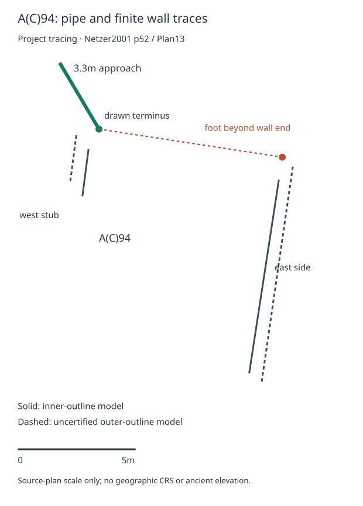

# A(C)94: early-pipe geometry check

6 October 2026 UTC. The user authorized trying the archived A(C)94 plans after the inventory audit. **Entry 29's identification with A(C)94 is not identifiable from available evidence.** A conditional plan test is now reproducible: the drawn pipe terminus misses both numeral bands under the specified shortest-distance envelopes; points farther along the approach can fit a different distance convention. Every nominal perpendicular foot lies beyond the finite wall ends. These findings distinguish the models without establishing an archaeological target.

## Source and exposure

Ehud Netzer, *Hasmonean and Herodian Palaces at Jericho*, Volume I: *Stratigraphy and Architecture* (2001), **Plan 13, printed p.52 / original viewer84 / extract7**, supplies the detailed drawing, north arrow and 0–5m scale. Printed pp.57–58 describe A(C)94 and its early ceramic pipe; Ills.84–85 on p.58 show the pool and area north of it. Printed pp.58–60 / Ills.86–88 distinguish AC44 and the southwestern channels; pp.67–69 cover A(C)90. [Archived source, page map and provenance](../../assets/plans/netzer2001-area-ac/README.md). The source extract SHA-256 is `cf08871210c59848655c4c4223cfe30334fe2737068b7b533d27b2b4713b2158`.

These pages and Plan13 were visually inspected on 3 October. This pass reinspected p.52, pp.51/57–60/67/69 and enlarged the drawing around the pipe and scale. A second reader independently inspected the full plan and three enlarged regions, checked the picks and finite projections, and identified the dimension discrepancy below. This is exploratory analysis of exposed evidence; no observation was reserved, no confirmatory freeze occurred, and reinspection adds no source scope or independent excavation campaign.

The report describes a pipe end found built into the **north short side** near the northwest corner, with **3.3m** preserved toward the northwest (p.57). The diagonal trace's location, direction and scale length support linking it to that notice. Its drawn terminus supplies a project sensitivity point; it supplies no measured aperture center, invert or contemporaneous surface. The later 15cm open channel has a missing terminal (pp.57–58). The separate southwestern network has its own observed portions and inferred links (p.60). Each retains its own phase and contact gate.

## Retained models

[Reading constraints](constraints.json) and [hydraulic branches](../../measurements/cycle15/jericho_conduit.md) remain the basis. Jericho and the from-side relationship are restored; large=longer is our interpretation. Northern qualifies the reservoir and provides no displacement bearing. The partly restored **24** and alternative **27** readings remain separate. At the exploratory **0.40–0.60m/cubit** continuum their bands are **9.6–14.4m** and **10.8–16.2m**. There is no independently calibrated local cubit or separate digging depth.

The target sets are declared separately: the drawn approach terminus alone, and every point along the complete drawn preserved approach. Neither target follows necessarily from the entry. Both west/east longer sides receive inner/outer contour models. The west inner model uses only its northern visible stub before the stairs; there is no hidden extension through them. Dashed outer contours are uncertified face hypotheses; the solid east interior outline also lacks an independently established surviving face at the pipe elevation. All measurements are **published-plan traces**, with archaeological face gates unknown.

Two measurement conventions are scored independently. A perpendicular foot must fall within the finite selected trace. Shortest straight distance to that trace can instead reach its endpoint; the entry does not prescribe this convention. Conduit chainage from a long side remains unknown: the reported pipe contacts the north short side, with no demonstrated connection to either long side. Adding a convenient wall route would invent an origin. Arbitrary wall-point, slope and vertical models retain unknown origins/surfaces; this pass cannot exclude all axes.

[Inputs](ac94_inputs.json) preserve the source/page hashes, full-page raster coordinates, finite endpoints, target sets, control gates and decisions. [Runner](ac94_measure.py) computes exact continuous segment extrema and clips the perpendicular target parameter interval; it does not sample a few convenient points. [Complete outputs](ac94_results.json) retain both numerals and both picking envelopes for every target/side/face combination.

## Calibration and uncertainty

All picks use the full p.52 PyMuPDF Matrix(2,2) raster, 1176×1570 pixels; PDF size588×784.8 points. Origin is upper left, x right/y down. The scale endpoints are (458.5,1442.5) and (593.5,1442.5): **135px =5m**. The pipe endpoints are (503,948) at its drawn terminus and (458,872) upstream: **3.27m**, consistent with the reported3.3m. No geographic CRS, world coordinate, source elevation or metric three-dimensional registration follows.

The manual envelope permits a4px Euclidean displacement disk at every selected point and1px at each scale endpoint. The approximate8px terminal symbol and blurred contour picks motivate the point envelope; the ticks are about1–2px wide. A stress envelope doubles both values. These are analyst visual-picking assumptions, not survey error estimates. Moving each target and wall segment by at most e bounds shortest-distance extrema by2e; scale endpoints give a separate ±2e scale-length bound. The resulting intervals are conservative outer bounds. Overlap of such bounds alone does not prove that a perturbed fit or finite projection exists.

An independent check found a datum discrepancy. The picked north inner-corner span is **8.18m**, close to the reported8.2m width. The east inner trace is **8.32m** and its dashed outer trace **9.32m**, while the text reports8.8m length (p.57). The inner trace differs by about0.48m, or5.5%. Keep the printed scale; do not rescale a contour to force that dimension. Which contour/elevation the dimension describes, scan distortion, actual wall-face position and phase uncertainty remain unbounded. Consequently even a result stable under the picking stress envelope cannot become a robust field exclusion.

## Results by target and axis

**Drawn terminus, shortest distance to each finite trace:** nominal west-inner0.96m, west-outer1.00m, east-inner7.93m and east-outer8.38m. The largest stress-envelope upper bound is **9.24m**, below24cubits'9.6m minimum and27cubits'10.8m minimum. Every retained numeral/unit/wall/face combination misses under these particular plan inputs and picking assumptions. This is a numerical failure of the **drawn-terminus target model**, with unknown total archaeological uncertainty. It is neither an exclusion of the real aperture nor of A(C)94 or entry29.

**Whole drawn approach, shortest distance to the finite traces:** the continuous nominal ranges are west-inner0.96–3.87m, west-outer0.96–3.15m, east-inner7.93–10.54m and east-outer8.38–10.83m. Both west models miss even under stress. Both east models overlap24cubits. The east-inner nominal range misses27cubits but its conservative manual/stress envelopes overlap; this is possible compatibility only. The east-outer nominal range overlaps27cubits at the low end of the unit continuum, approximately **0.4000–0.4010m/cubit**. No local calibration supports choosing that narrow interval. Full nominal attainable unit intervals are saved, without selecting a winning value.

**Perpendicular to a finite trace:** all nominal target points, including the entire pipe segment, project north of all four finite starts. Therefore **zero nominal points qualify**. Extending the east wall lines would produce superficially useful offsets; those feet are outside the permitted wall segments. The east-outer terminus foot lies only about0.40m beyond its start, so uncertain endpoint placement prevents asserting that the finite-projection gate fails for every perturbed drawing. For upstream east models, shortest-distance envelope overlap does not establish an admissible perpendicular fit. Those constrained perturbations remain unscored/unknown. Terminus and west-side distance envelopes still miss even if a perturbed perpendicular foot became eligible, within the stated visual assumptions.

**Along the conduit or another axis:** unknown origins and ancient surfaces remain unknown. The early pipe cannot supply a starting junction with a long side merely because it reaches the short north side. The unobserved upstream continuation receives no invented target points.

This project vector tracing shows selected source contours, the finite pipe and one perpendicular foot beyond the east-inner wall end. It omits other architecture and reproduces no source pixels. Dashed contours are uncertified outer-face models. Its scale is inherited from Plan13; it is not a complete footprint, survey, site bearing or deposit coordinate.

## Same-rule controls and limits

The nearby Plan13 pools **J05/A(C)90** and **J09/AC44** receive both numerals, the full cubit continuum, both long sides/faces, both target sets, the same axes and the same picking envelopes wherever recoverable. Their absent terminals and pipe traces remain null; neither is scored as a failure.

- **A(C)90:** pp.67–69 describe four corner soundings, an unreached bottom and apparent channel supply at the southwest corner; Stage4 versus6 remains open. A structural pool/conduit-corner contact is not an authenticated inlet. The+105.40 rim is assumed (p.69). A recoverable phase-specific aperture and observed route are required before these metric models can run.
- **AC44:** pp.58–59 give the surviving western half,8.8m length and an8m width assumed by analogy. Page59 explicitly reports no water-supply data; Stage2pipe/Stage3channel is inferred from A(C)94. The nearby20m channel is interpreted as overflow (p.60), without an excavated pool-wall junction. Neither an assumed rectangle nor that channel's37cm fall supplies an inlet datum.

The [28-record normalization](inventory_normalization_2026-10-06.json) retains the other notices, successive states and unresolved identities. This is a finite comparison within one plan/source scope, not a regional pool census. Eligible-basin and regional denominators remain null. The earlier large north/south pools' nonunique27-cubit offsets remain their separate test; they cannot inherit this small pool's found pipe. There is no unseen prediction or landscape-wide discrimination.

## Decision, reopening and accounting

The exact archaeological claim—**entry29 identifies A(C)94 and a target measured from a long side**—ends **not identifiable from available evidence**. The drawn-terminus shortest-distance branch fails numerically under its visual envelopes; the broader finite-pipe shortest-distance branch survives, and the remaining aperture/face/axis/phase/northern-reference gates remain unknown. A plan-level miss excludes only the stated plan model. The earlier large-pool assessment and its outcome ledger remain at their recorded scope.

Reopen this source-plan test only for a documented pick, scale or analytical correction. A new archaeological test needs an aperture/invert tied to a **named ancient wall face and contemporaneous surface**, the early pipe's dated coexistence, and an independently justified northern reference. Its claim, target set, axis and field tolerances must precede any genuinely unused observation. A collection-continuation hypothesis additionally requires its own connected collector evidence. The existing drawings alone cannot supply these observations. Plans14/15/23 acquisition and the previous broad hunts remain parked; no new outreach or fees occurred.

This pass adds **one bounded existing-source pipe/finite-wall geometry check**, taking activity from70/5/77 to **70 scoped targets /5 cartographic intakes /78 bounded checks**. Reinspection, independent review, rendering and mechanics checks add none. The two numerical target hypotheses belong to one check, not separate archaeological tests. No formal conditional-assessment packet, outcome-ledger exclusion, decisive identification, question closure, campaign, confidence or geographic-coordinate increment follows. The formal outcome count stays unchanged because these plan hypotheses lack certified field datums and a total archaeological error bound.

Recompute with `python research/assessments/entry29_jericho_pools/ac94_measure.py`; verify the source checksum and saved outputs without rewriting with the same command plus `--check`.
