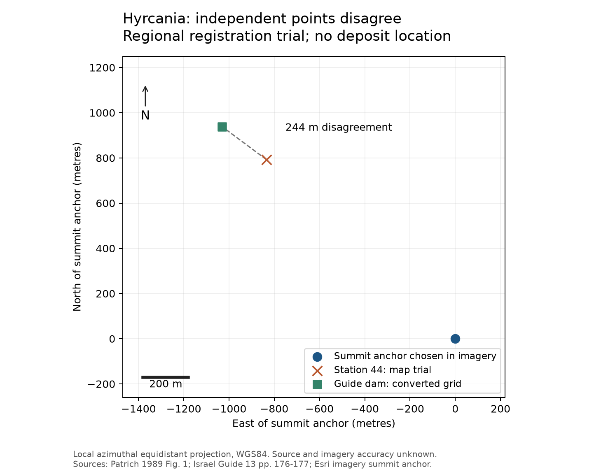

# Hyrcania: plan registration and entry tests

Reviewed 30 September 2026. **Result:** the regional map has been provisionally registered and checked against the guide's dam coordinate. The points disagree by approximately **244 m**. The detailed fort plan supports positions within the drawing, but its geographic registration has not passed a control-point check. Hyrcania remains **possible, low** for entries 16, 29 and 35.

## What was registered

Patrich 1989 Fig. 1, p. 243, has a north arrow, 2-km scale and numbered stations. In the supplied scan `256.jpg`, the manually selected fort symbol is approximately `(754,850)` and station 44's intake dam `(673,780)`. The 2-km bar spans approximately 186 pixels. These picks locate symbols, not surveyed corners. [Kotar volume](https://kotar.cet.ac.il/KotarApp/Viewer.aspx?nBookID=6765980).

A north-and-scale transformation places the drawing relative to a manually selected summit-area point in [Esri World Imagery](https://server.arcgisonline.com/arcgis/rest/services/World_Imagery/MapServer). The reference export is in EPSG:3857; its returned extent and pixel dimensions are retained. Calculations use a local azimuthal equidistant projection on WGS84. Imagery acquisition date and absolute positional accuracy were not established. One anchor cannot supply a meaningful fit RMSE.

The guide's `1837.1261` was **withheld from the transformation**. Under the provisional interpretation of four-digit components in 100-m units, this is old-grid `183700/126100`, converted using EPSG:28191. Its rounding convention and precise surveyed feature are unspecified. [Israel Guide vol. 13](https://kotar.cet.ac.il/KotarApp/Viewer.aspx?nBookID=75901013), pp. 176-177.

| Position | Latitude | Longitude | Status |
| --- | --- | --- | --- |
| Summit anchor selected in imagery | 31.71895 | 35.36562 | Approximate fort anchor |
| Station 44 predicted from Fig. 1 | 31.72610 | 35.35681 | Unvalidated map prediction |
| Guide's converted dam point | 31.72741 | 35.35474 | Published grid interpretation |

Decimals make the calculation reproducible; they do not describe location accuracy. The prediction and guide point differ by **244.4 m**. Substituting the atlas's existing approximate fort point gives **271.1 m**, so that anchor choice alone does not remove the disagreement. Map generalization, scale/orientation assumptions, grid notation or a different feature assignment could explain it. This comparison neither confirms nor disproves that both sources describe station 44.

The summit-to-guide straight distance is approximately **1.39 km**. That is not an aqueduct route measurement and does not reconcile the guide's 1.2 km with Patrich's 1.95 km. A route polyline with known endpoints is still required.

## Detailed pool and cistern plan

Fig. 22, p. 256 (`269.jpg`), has a 50-m scale. Its northern and southern double-pool members, separate filled pool, passage 49 sector, cistern S and cistern F now have explicit **source-image positions** in the [registration record](../../registration/hyrcania_plan_registration_2026-09-30.json). These are approximate centers or labeled sectors, not geographic footprints.

Candidate monastery corners were compared with imagery. A consistent correspondence was not established; some pool edges are obscured by shadow. No independently surveyed bridge/pool controls were recovered. A precise geographic fit would therefore depend on unverified feature matches. The regional transformation is not accurate enough to supply those controls. Geographic pool, tunnel and deposit coordinates remain unset.

## Entry 29: a numerical test now conflicts with one interpretation

The project [translation](../../text/translation_en.json), VII 3-7, retains a damaged conduit name, disputed reservoir qualification, four sides and **24 cubits**. The [reading record](../../text/readings.json), `e29-qi` and `e29-reservoir`, preserves Kidron/Kypros/collection and Jericho/Hyrcania alternatives; see Puech 2015 p. 64 n. 252 and Eshel 2002 pp. 103-105. No new manuscript reading is asserted here.

Patrich p. 255 reports the northern pool's sides as **19 m south, 15 m west, 18.2 m north and 16 m east**. The paragraph continues from the right column into the left. At the sensitivity range of 0.445-0.525 m per cubit, 24 cubits is **10.68-12.60 m**.

- **If 24 cubits describes a side length:** none of the four reported sides fits.
- **If it describes the perimeter:** their sum, 68.2 m, does not fit.
- **If it describes an offset from the sides:** the side-length comparison does not test that interpretation. The text does not yet establish an inward/outward convention or a unique measuring origin.

These conditional failures reduce the usefulness of a simple dimensional match; they do not resolve the reading or reject every Hyrcania model. Entry 16's earlier passage-49 test remains valid: 40/41 cubits exceed the reported surviving 11.5 m under a horizontal-travel interpretation; 14 fits but identifies no landmark. The filled end leaves original total length unknown. [Earlier test](https://github.com/quadrin/CopperScroll/blob/main/research/sites/christmas_hyrcania_primary_followup_2026-09-30.md#an-explicit-falsification-test-for-entry-16).

## Best next source

Obtain the excavation team's georeferenced plan or control coordinates for bridge 48 and both pools, plus phase/context records. Excavation is current enough to warrant asking for these: a [2023 university partner report](https://www.cn.edu/historic-archeological-dig-connects-judean-desert-to-east-tennessee/) describes the new project, and a [March 2026 firsthand account](https://www.cn.edu/beneath-the-collapse/) records fieldwork on 26 February 2026. Neither reviewed account supplies a surveyed pool plan or proves use of this water system around CE 70. The 1996 book's excavation-status statement is historical.
