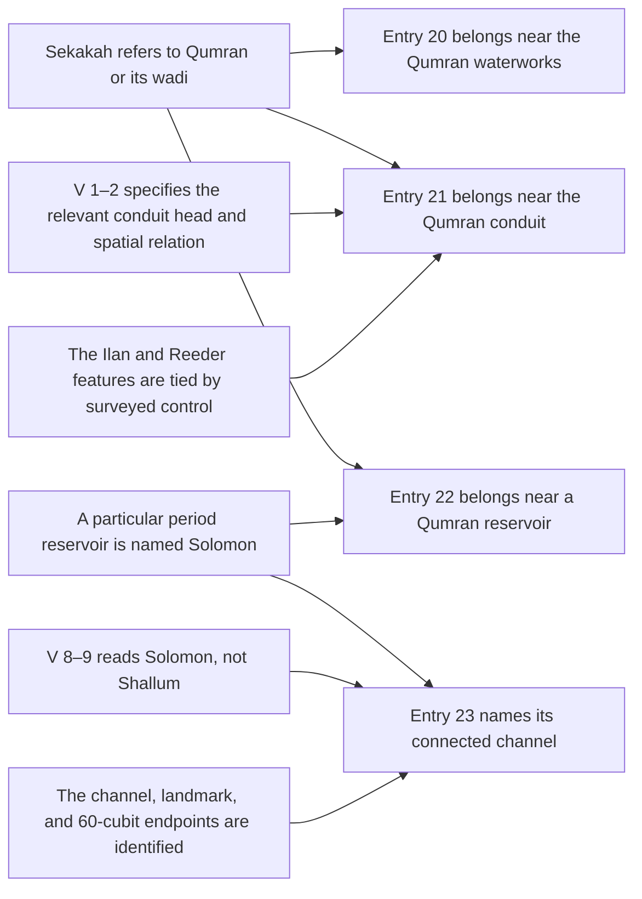

# Entries 20–23: Qumran dependency and spatial test

30 September 2026. This is a model audit, not a new site identification or a field observation. It uses the [entry 21 feature comparison](entry21_feature_comparison.md), [direct Ilan–Amit plan review](ilan_amit_1989_plan_review.md), [Reeder–Jol registration review](qumran_georeferencing_review.md), [photograph crosswalk](qumran_photo_correspondence.md), and the [four-entry review](qumran_archival_photo_video_review.md). The project's translation is in `text/translation_en.json`. Source editions and figure numbers are given in those reviews.

## Which claims depend on which others

The apparent four-entry cluster does not supply four independent matches. The graph below makes its assumptions explicit. An arrow means that the claim at its end requires the claim at its start; it does not mean the start is true.

The shared `S` premise is a **site hypothesis**, not a consequence of adjacency. `R` and `N` are separate: a plausible Solomon reading would not independently establish the name of a particular reservoir. The surviving conduit head, Sekakah, and north wording in entry 21 give a useful test; the restored link and stone cannot select a boulder and then confirm it. The source dependence is documented in [the feature review](feature_investigation.md#entry-21-sekakah-and-qumran).

## Spatial alternatives to keep live

| Entry | Text-conditioned alternative | Physical comparison | Present result | Discriminating observation |
| --- | --- | --- | --- | --- |
| 20 | Cairn/heap in Sekakah's valley | A period cairn in the wadi | No particular cairn identified. | A dated, described cairn with a recorded position; do not substitute a hydraulic wall. |
| 20 | Dam interpretation | Ilan–Amit point 4 or Reeder's upstream wall | Ilan's main-basin dam is inferred without reported surviving fabric; the two structures have no demonstrated identity. | Independent spatial and construction-phase tie between the wall and the proposed dam. |
| 21 | Head of the **whole** conduit | Ilan–Amit point 3, at a small north-bank ravine | Best functional comparison, exact-feature identity low. | Surveyed connection from the collection ravine through the boulder–pothole–wall sequence to point 3. |
| 21 | Head of a **branch or phase** | Short-tunnel junction or point 16; long-tunnel mouth only under a narrower subsection reading | A different ranking is possible; phase boundaries have not been independently dated. | Original route, floor elevations, and stratigraphy distinguishing heads of separate construction stages. |
| 22 | Fissure **east** of a named reservoir | Tunnel openings east of Ilan basin 2, or a fissure east of a settlement reservoir | Geometrically possible on the published drawing. No basin has an independently established Solomon name or dated fissure match. | Independently identify and date the reservoir; then map and inspect its eastern fissures. |
| 23 | Channel of Solomon | A channel demonstrably connected to the same reservoir as entry 22 | Requires the name reading, a reservoir name, and a hydraulic connection. None is established. | Independent V 8–9 reading followed by a phase-specific plan tie. |
| 23 | Channel of Shallum | A separately named channel | No local installation identified. | Textual reading first; then search independently for a dated channel and large landmark. |

The final instruction of entry 23 runs from a trench/channel to a large heap or other disputed landmark for **sixty cubits**, then says to dig three cubits. Under the project's working cubit range of 0.445–0.525 m, sixty cubits is roughly **26.7–31.5 m**. That is a conditional length conversion, not a radius. The source does not identify either endpoint, a measurement path, or a modern point; no map buffer is warranted. The trench name and landmark reading also vary by edition ([Qumran reference review](qumran_reference_review.md#test-entries-separately-before-joining-them)).

## Test order and stopping rules

1. **Read before matching.** Have readers who have not seen the Qumran candidate assess V 1–3 and V 8–9 from the best legally accessible plates, recording preserved strokes, restorations, grammar and alternatives. Record whether an image actually resolves a disputed letter. A model's preference is a search lead, not a new manuscript reading.
2. **Identify independent physical observations.** Separate an observed channel bed, wall, pothole, boulder and tunnel openings from names and reconstructed lines in each survey. The Ilan–Amit 1989 plan and Reeder–Jol 2006 plan are separate drawing frames; their currently available two-anchor similarity has a large sensitivity range and no geographic control. A caption match must not become an extra observation.
3. **Tie the surveys where possible.** Ask for the original 2002 total-station/CAVEPLOT observations, station descriptions, datum and original photographs named in [the survey-data search](qumran_survey_data_search.md). Use distributed stable control points and independent check points. If those records remain unavailable, retain only a source-plan-relative comparison.
4. **Check date and direction.** For each surviving construction segment, record its excavation phase, flow direction, and whether later repair altered it. A reconstructed dam cannot serve as the observed period landmark for entry 20. A downstream tunnel mouth cannot be the head of the whole conduit.
5. **Join entries only after individual checks.** A failed reading or dated feature match closes that branch of the model. A positive match for one entry raises the value of testing nearby entries but does not verify them. Record alternative sites and physically similar negative controls, so a generic pool or conduit is not counted as distinctive.

## Present finding

The Qumran water system remains a productive test case because the published plans contain several distinct installations. The strongest entry 21 comparison is still Ilan–Amit point 3. The remaining entries do not yet independently narrow it: entry 20's feature type is disputed, entry 22's reservoir name is unassigned, and entry 23's name and distance endpoints are unsettled. The current evidence supports **low exact-feature confidence** and no new geographic coordinate or deposit location.
